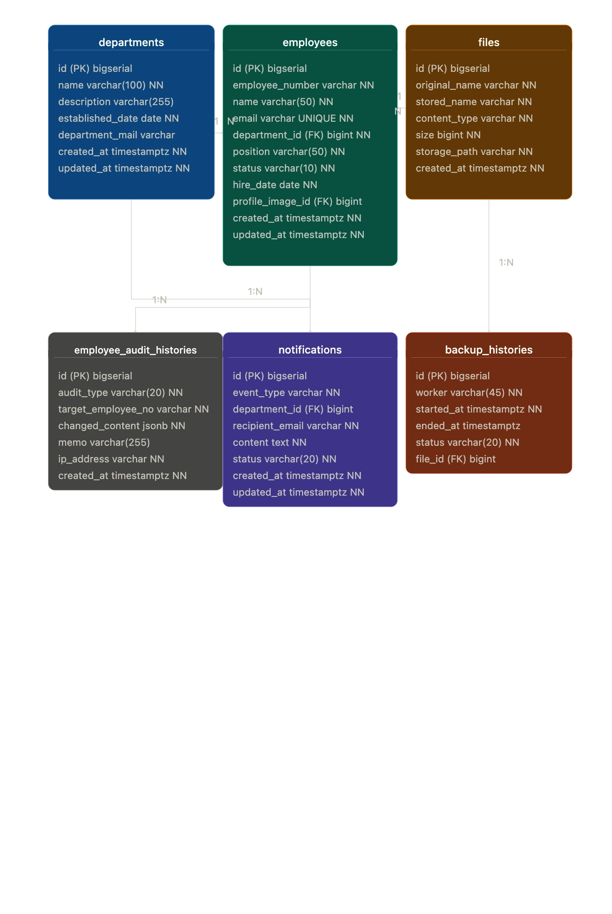

# HRBank(Backend)

본 프로젝트는 기업의 핵심 인사 관리(HR) 업무를 안정적으로 처리하기 위한 백엔드 시스템입니다.

핵심 인사 데이터를 중앙에서 안전하게 관리하고, Spring Scheduler 기반의 자동화된 주기적 백업, 리포트 생성으로 HR 담당자가 반복업무 없이 데이터를 신뢰할
수 있는 EMS

**[HRBank 서비스](https://sb11-hrbank-team3-production.up.railway.app/#/dashboard)**

---

## R&R

- **강우진(PM)**: 직원 정보 관리 기능 및 알림 기능 구현
- **김진혁**: 첨부 파일 관리 기능과 직원 정보 조회 기능 및 DB 환경 연동
- **김하빈**: 부서 관리 기능 및 메인 대시보드 API 구현
- **이경신**: 수정 이력 관리 기능 및 백엔드 공통 모듈 개발
- **이윤선**: 데이터 백업 관리 및 Railway 배포 환경 구성

---

## 기술 스택

### Language & Build


### Backend


### Database


### Utility & API Docs


### Infrastructure


### Cooperation


---

## 주요 기능 및 API 명세

팀원별 담당 도메인에 따른 핵심 API 엔드포인트입니다. 전체 API 명세는 프로젝트 실행 후 Swagger UI(
`http://localhost:8080/swagger-ui/index.html`)에서 확인하실 수 있습니다.

### 직원 관리 API

| 기능명        |  Method  | API 엔드포인트                           |
|:-----------|:--------:|:------------------------------------|
| 직원 목록 조회   |  `GET`   | `/api/employees`                    |
| 직원 등록      |  `POST`  | `/api/employees`                    |
| 직원 상세 조회   |  `GET`   | `/api/employees/{id}`               |
| 직원 삭제      | `DELETE` | `/api/employees/{id}`               |
| 직원 수정      | `PATCH`  | `/api/employees/{id}`               |
| 직원 수 추이 조회 |  `GET`   | `/api/employees/stats/trend`        |
| 직원 분포 조회   |  `GET`   | `/api/employees/stats/distribution` |
| 직원 수 조회    |  `GET`   | `/api/employees/count`              |

### 부서 관리 API

| 기능명      |  Method  | API 엔드포인트               |
|:---------|:--------:|:------------------------|
| 부서 목록 조회 |  `GET`   | `/api/departments`      |
| 부서 등록    |  `POST`  | `/api/departments`      |
| 부서 상세 조회 |  `GET`   | `/api/departments/{id}` |
| 부서 삭제    | `DELETE` | `/api/departments/{id}` |
| 부서 수정    | `PATCH`  | `/api/departments/{id}` |

### 직원 정보 수정 이력 관리 API

| 기능명               | Method | API 엔드포인트                |
|:------------------|:------:|:-------------------------|
| 직원 정보 수정 이력 목록 조회 | `GET`  | `/api/change-logs`       |
| 직원 정보 수정 이력 상세 조회 | `GET`  | `/api/change-logs/{id}`  |
| 수정 이력 건수 조회       | `GET`  | `/api/change-logs/count` |

### 데이터 백업 관리 API

| 기능명          | Method | API 엔드포인트             |
|:-------------|:------:|:----------------------|
| 데이터 백업 목록 조회 | `GET`  | `/api/backups`        |
| 데이터 백업 생성    | `POST` | `/api/backups`        |
| 최근 백업 정보 조회  | `GET`  | `/api/backups/latest` |

### 파일 관리 API

| 기능명     | Method | API 엔드포인트                  |
|:--------|:------:|:---------------------------|
| 파일 다운로드 | `GET`  | `/api/files/{id}/download` |

### 알림 기능 (자체 기획)

- 직원 입사/퇴사, 백업 성공/실패 시 이메일 알림 발송
- Spring ApplicationEventPublisher 기반 이벤트 아키텍처
- Mailtrap HTTP API 활용 (Railway 프리티어 SMTP 포트 차단으로 인해 HTTP API 방식으로 전환)

**한계점**

- Mailtrap 무료 플랜 월 50건 발송 제한
- 초당 발송 건수 제한으로 동시 이벤트 발생 시 일부 메일 미발송 가능

---

## 공통 응답 및 예외 처리

본 프로젝트는 클라이언트와의 원활한 협업과 API의 일관성을 유지하기 위해,`GlobalExceptionHandler`를 통해 전역으로 예외를 핸들링합니다.

### 전역 예외 처리기 (`@RestControllerAdvice`)

컨트롤러 계층에서 발생하는 모든 예외를 모아 `GlobalExceptionHandler`를 구현했습니다.
이를 통해 비즈니스 로직에 예외 처리 코드가 섞이는 것을 방지하고 서버 내부 에러가 클라이언트에게 직접 노출되지 않도록 하였습니다.

### SLF4J를 활용한 레벨별 로깅

발생하는 예외의 심각도에 따라 SLF4J를 이용해 로깅 레벨을 분리했습니다.
클라이언트의 단순 입력 실수나 비즈니스 예외는 `WARN`으로,
서버 내부의 치명적인 결함이나 DB 에러는 `ERROR`로 나누어 기록함으로써 운영 환경에서의 디버깅 및 모니터링 효율을 극대화했습니다.

### 공통 에러 응답 포맷 (`ErrorResponse`)

어떤 API에서 에러가 발생하더라도 프론트엔드 개발자가 예측 가능하고 처리하기 쉽도록, 모든 에러 응답은 아래와 같은 통일된 `ErrorResponse` JSON 규격으로
반환됩니다.

```json
{
  "timestamp": "2026-04-23T05:42:11.537Z",
  "status": 500,
  "message": "서버 내부 오류가 발생했습니다.",
  "details": "/api/employees/count"
}
```

---

## 도메인 구조

```text
src/main/java/com/hrbank3/hrbank3
├── common
├── config
├── controller
├── dto
├── entity
├── event
├── mapper
├── repository
│   ├── condition
│   └── custom
├── service
└── Hrbank3Application.java

src/main/resources
├── static
├── application.yaml
├── application-dev.yaml
├── application-local.yaml
├── application-prod.yaml
├── schema-h2.sql
└── schema-postgres.sql
```

---

## 아키텍처 및 데이터베이스 설계

### ERD



### DDL 스키마

로컬 환경 구동 시 H2 Database는 애플리케이션 실행 시 자동 초기화됩니다.
운영용 PostgreSQL 데이터베이스를 직접 세팅하셔야 할 경우, 다음 경로의 DDL 스크립트를 활용해 주세요.

* 로컬 H2 환경: `src/main/resources/schema-h2.sql`
* 운영 PostgreSQL 환경: `src/main/resources/schema-postgres.sql`

---

## 커밋 및 브랜치 전략

안정적인 협업을 위해 `Issue 기반 워크플로우`를 준수하며, 명확한 브랜치 전략과 커밋 규칙을 따릅니다.

### 브랜치 전략 (Git Flow)

| 브랜치명                    | 설명                                                  |
|:------------------------|:----------------------------------------------------|
| `main`                  | 배포 시 사용하는 정식 버전 브랜치                                 |
| `develop`               | 기능들을 통합하는 브랜치이자 각 기능들이 병합될 브랜치                      |
| `feature/{이슈번호}-{기능요약}` | 각 기능 별 실제 작업 브랜치 (예: `feature/13-common-exception`) |
| `fix/{이슈번호}`            | 기능 개발 중 발생한 버그를 수정하고 통합하는 브랜치                       |

---

### 커밋 컨벤션

```
태그명: 제목 [#이슈 번호]
```

- 태그의 첫 글자는 대문자
- 본문은 선택사항
- 제목은 한글로 작성

| Tag        | 설명                                        |
|:-----------|:------------------------------------------|
| `Feat`     | 새로운 기능 추가 및 변경                            |
| `Fix`      | 버그 수정                                     |
| `Refactor` | 실제 기능 변경은 없지만 코드를 수정하는 경우                 |
| `Docs`     | 문서 수정                                     |
| `Style`    | 코드 포맷팅, 세미콜론 누락 등 동작에 영향을 주는 코드 변경이 없는 경우 |
| `Test`     | 테스트 코드 관련 모든 동작                           |
| `Chore`    | 주석 수정, 불필요 코드 및 Import 제거 등               |
| `Build`    | 배포 관련 작업                                  |

---

## 사전 요구 사항

프로젝트를 실행하기 전, 다음 항목들이 로컬 환경에 설치되어 있어야 합니다.

* **Java:** JDK 17 이상
* **DB:** PostgreSQL 15 이상 (로컬 실행 시)
* **IDE:** IntelliJ IDEA (권장)

---

## 환경변수

프로젝트를 로컬 환경에서 실행하거나 서버에 배포하기 위해서는 아래의 환경 변수 설정이 필요합니다.
`.env` 파일이나 IDE의 실행 환경 변수에 다음 항목들을 추가해 주세요.

| 환경 변수명                       | 설명                             | 예시 / 기본값                                  |
|:-----------------------------|:-------------------------------|:------------------------------------------|
| `SPRING_PROFILES_ACTIVE`     | 실행할 스프링 프로필 설정                 | `local`/ `dev`/ `prod`                    |
| `SPRING_DATASOURCE_URL`      | PostgreSQL 데이터베이스 연결 URL       | `jdbc:postgresql://localhost:5432/hrbank` |
| `SPRING_DATASOURCE_USERNAME` | 데이터베이스 접근 계정 이름                | `user_name`                               |
| `SPRING_DATASOURCE_PASSWORD` | 데이터베이스 접근 비밀번호                 | `user_password`                           |
| `MAILTRAP_API_TOKEN`         | 이메일 알림 발송을 위한 Mailtrap API 토큰  | `abc123def456...`                         |
| `NOTIFICATION_ADMIN_EMAIL`   | 알림을 수신할 시스템 관리자 이메일            | `admin@hrbank.com`                        |
| `FILE_UPLOAD_PATH`           | 프로필 이미지 등 첨부파일이 저장될 절대 경로      | `./uploads/`                              |
| `BACKUP_DIR`                 | Spring Batch 데이터 백업 파일이 저장될 경로 | `./backups/`                              |

## 시작하기

로컬 환경에서 프로젝트를 실행하기 위한 설정 방법입니다.

**주의:** 프로젝트를 실행하기 전, **[환경 변수 세팅]** 을 먼저 완료해야 서버가 정상적으로 구동됩니다.

```bash
# 레포지토리 클론
git clone https://github.com/5ooooooj/sb11-hrbank-team3.git

# 디렉토리 이동
cd sb11-hrbank-team3

```

**[Mac / Linux]**

```bash
# 빌드 및 실행
./gradlew build -x test
./gradlew bootRun

```

**[Windows]**

```bash
# 빌드 및 실행 (명령 프롬프트 또는 PowerShell)
gradlew.bat build -x test
gradlew.bat bootRun
```